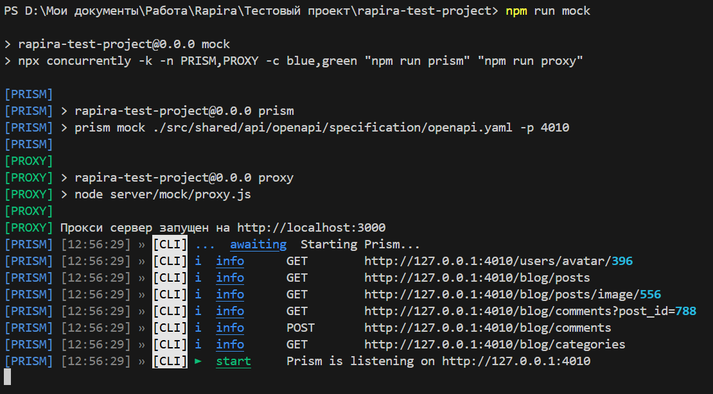

# Тестовое задание для компании Rapira

Представляет из себя галарею изображений с возможностью их фильтрации по категориям и заголовку. При нажатии на изображение, можно прочитать более подробную информацию о нем, просмотреть комментарии других пользователей и оставить свой.

## Запуск проекта

Для того чтобы запусть проект нужно проделать следующие шаги:

### Установить зависимости

```sh
npm install
```

### Добавить файл .env

В корне проекта необходимо создать файл .env в корне проект. Его содержимое можно продублировать из файла .env.example.

### Запустить мок сервер

```sh
npm run mock
```

После успешного запуска мок сервера вывод в консоль должен выглядеть следующим образом:



### Запустить dev сервер

```sh
npm run dev
```

Проект запущен локально и готов к работе!

## Документация

- [Конфигурация](#конфигурация-проекта)
- [Мок сервер](#мок-сервер)
- [Архитектура](#архитектура-проекта)
- [Используемые технологии](#используемые-технологии)

## Конфигурация проекта

С помощью переменных среды можно кастомизировать некоторые опции запуска проекта.

### VITE_API_BASE_URL

Данная переменная должна содержать URL на бекенд сервер.

Значение по умолчанию: http://localhost:3000 - это URL на котором запускается мок сервер по умолчанию.

### API_MOCK_PROXY_PORT

Данная переменная конфигурирует на каком порту локально запускается мок сервер.

Значение по умолчанию: 3000.

### VITE_USER_LAST_NAME и VITE_USER_FIRST_NAME

Так как на данный момент сервис не предоставляет возможности регистрации или аунтефикации, то данные текущего пользователя можно сконфигурировать через данные параметры.

По умолчанию значения параметров: Фамилия Имя.

## Мок сервер

Для симуляции работы бекенд составляющей проекта используется мок сервер. Мок сервер состоит из двух частей:

- **PRISM SERVER**: Сервер сгенерированный с помощью библиотеки [_Prism_](https://stoplight.io/open-source/prism) на основе [_OpenApi спецификации_](https://swagger.io/specification/). Является ядром мок сервера. Запускается локально на порту 4010.

- **PROXY SERVER**: Прокси сервер реализованный с помощью [_Express.js_](https://expressjs.com/). Необходим, так как **PRISM SERVER** не может возвращать изображения и обрабатывать параметры маршрутов. По умолчанию запускается локально на порту 3000.

Проксируя запросы, **PROXY SERVER** добавляет задержку в 2 секунды, симулируя ожидание ответа от бекенда.

К сожалению, на данный момент сконфигурировать порт запуска через переменные среды можно только для **PROXY SERVER**.

## Архитектура проекта

За основу структуры проекта был взят архитектурный паттерн [**Feature-Sliced Design (FSD)**](https://feature-sliced.design/).

Кратко рассмотрим базовые концепции данного паттерна.

### Слои (Layers)

Согласно методологии, кодовая структура проекта разделяется на шесть слоев:

- **SHARED**: переиспользуемый код, который не несет в себе бизнес логику. Нижний и самый абстрактный уровень приложения.

- **ENTITIES**: содержит определение сущностей бизнес логики.

- **FEATURES**: содержит определение доступных фичей (функциональностей) приложения. Описывает различные действия над сущностями бизнес логики.

- **WIDGETS**: содержит крупные виджеты (компоненты, фрагменты сайта), группирующие внутри себя различные фичи и сущности.

- **PAGES**: содержит компоненты контейнеры для страниц. Объединяет различные виджеты, фичи и сущности внутри одной страницы.

- **APP**: код, затрагивающий функционал всего приложения (маршрутизаторы, глобальные провайдеры, конфигурацию и так далее). Самый верхний уровень приложения.

**ВАЖНО:** Слои имеют строгую иерархическую структуру от нижнего (**SHARED**) до верхнего (**APP**).

### Модули (Slices)

Все слои, кроме **SHARED** и **APP** дополнительно делятся на модули (slices). Деление происходит на основание бизнес логики.

Каждый модуль на слое является независимым от других модулей на этом же слое.

Доступ к содержимому модуля извне регламентируется с помощью **публичного API (Public API)**. Все что не реэкспортируется через публичный API считается приватным. Таким образом достигается инкапсуляция модулей.

**ВАЖНО:** Так как модули на одном слое должны быть независимы друг от друга то существует правило импорта:

**Модуль может использовать код, определенный только на слоях строго ниже.**

Существует исключение. На слое **ENTITIES** кросс-импорты разрешаются, но они разрешены только для типов и должны быть регламентированы с помощью [специального @x API](https://feature-sliced.design/docs/guides/examples/types#business-entities-and-their-cross-references).

### Сегменты (Segments)

Для удобство, модули разбивают на сегменты (segments). Принцип разделения основан на функциональности и выполняемых кодом задачах.

В проекте определены следующие сегменты:

- **MODEL**: доменная область модуля. Описывает структуру данных (типы, классы). Также в этом сегменте я размещаю сторы.

- **UI**: логика отображения (стили, UI kit, компоненты и ассеты).

- **API**: взаимодействие с бекендом или сторонними сервисами.

- **LIB**: вспомогательный код.

- **CONFIG**: конфигурация модуля (константы и т. д.).

- **LOCALE**: конфигурация интернализации. Содержит словари.

### Особенности моей архитектуры

Несмотря на то, что слой **SHARED** не предназначен для бизнес логики, в целях удобства я перенес конфигурацию API клиента на этот уровень.

Также в корне проекта находится папка ./server/mock в которой описан используемый мной мок сервер.

## Используемые технологии

### Маршрутизация

Маршрутизация в проекте реализована с помощью библиотеки [_Vue Router_](https://router.vuejs.org/).

В приложении определены 3 страницы:

- **/home** - главная страница, открывается по умолчанию. На данный момент содержит заглушку.

- **/blog** - страница блога. Содержит основной функционал приложения.

- **404** - страница, открывающаяся при несовпадении пути ни с одним из выше перечисленных.

### OpenApi спецификация

Для настройки взаимодействия с бекендом, структура API была описана с помощью OpenAPI спецификации (OAS).

API клиент генерируется автоматически с помощью библиотеки [_Hey Api_](https://heyapi.dev/) при запуске команды:

```sh
npm run openapi
```

### I18n

С целью улучшения маштабируемости проекта в приложение была интегрированная интернационализация с помощью библиотеки [_Vue I18n_](https://vue-i18n.intlify.dev/).

Конфигурация I18n находиться на слое **SHARED** в сегменте locale. Там определены правила плюрализации, работы с датами и глобальные словари.

Также, внутри отдельных модулей может также встречаться сегмент locale, который описывает локализацию специфичную для конкретного модуля.

Дополнительно, для обработки дат, имеющих нестандартный формат (например 6 Апр) были добавлены кастомные форматеры дат, которые также описаны в сегменте @/shared/locale. В будущем возможно имеет смысл настроить форматер использую какую нибудь из библиотек по типу dayjs или data-fns.

На данный момент в проекте добавлена только русская локаль (ru-RU).

### Стили

В основном, для стилизации проекта был использован фреймворк [_Tailwind_ v4](https://tailwindcss.com/), предоставляющий гибкую настройку темы и множество утилитарных классов.

В некоторых случаях для стилизации использовался препроцессор _Sass_, но его использование было ограничено, так как _Tailwind_ начиная с версии 4 сам по себе является препроцессором и плохо интегрируется с другими препроцессорами. Поэтому в проекте определены два корневых index файла для стилей: один для _Tailwind_, а другой для _Sass_.
